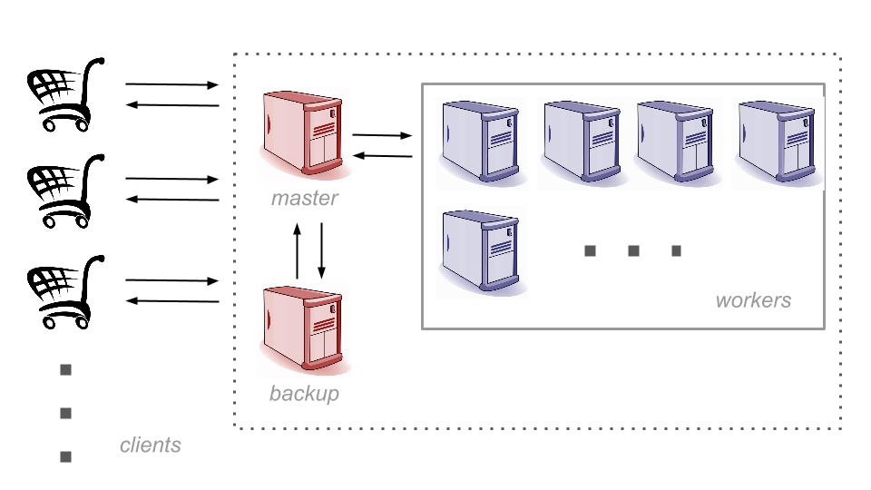

# Cloud Computing Systems 2017 - ZooKeeper

Modern computing infrastructures consist of very large clusters of commodity servers.
Inside a cluster, failures are norm.
For instance, Google [reports](http://www.cnet.com/news/google-spotlights-data-center-inner-workings) that "in each cluster’s first year, it’s typical that 1,000 individual machine failures will occur".
To ensure high-availability of services under such circumstances, it is necessary to take actions, in particular to mask/hide/tolerate the failures of nodes in the most transparant manner.
A common approach toward to tackle these challenges is to implement redundancy and appropriate failure-handling mechanisms.

In this second mini-project, we will implement fault-tolerance techniques in a distributed setting.
Your objective is to build a *dependable master/worker architecture* that executes *tasks* dispatched by *clients*.
To this end, you will leverage [Apache ZooKeeper](zookeeper.apache.org), a scalable and fault-tolerant coordination service at the core of the [Hadoop](http://hadoop.apache.org/) stack.

In the following, you will start few instances of the **ZooKeeper** service using its [Docker image](https://hub.docker.com/_/zookeeper/) and *docker-compose*.

Then, we introduce zk-shell, a convenient tool to use interactively ZooKeeper as well as Kazoo, a powerful Python library to drive ZooKeeper.
Further, we present the leader election building block to implement.
Finally, we describe the core of this project, e.g. the master/worker architecture.

Fork this repository to start the assignment.

You need to complete all the  items marked by **[EXERCISE]**.


## 0 - Pre-requisites
You must have installed *Docker* and *docker-compose* (see tutorial 2 if needed).

Some knowledge of the Python programming language.
There are plenty of very good tutorials online, and you should be able to learn the basics very quickly.
A good tutorial is [here](http://www.learnpython.org/en/).
We rely on Python 2.7, the most recent version of the 2.x series.


## 1.1 - ZooKeeper

**[EXERCISE]** Instantiate 3 instances of ZooKeeper on Docker using the [`docker-compose.yml` file](https://github.com/31z4/zookeeper-docker#-via-docker-compose)) from the documentation:
```bash
$ docker-compose up -d
```


## 1.2 - ZK-Shell

A common tool to inspect ZooKeeper is *zk-shell*, an interactive command line interpreter.
This interpreter is available via the [following](https://github.com/rgs1/zk_shell) repository on GitHub.
You can follow the indication given in *README.md* to install it with *pip*.

**[EXERCISE]** Using zk-shell, create the permanent paths */master*, */tasks*, */data* and */workers*.

Hint: follow the examples given [here](https://github.com/rgs1/zk_shell#usage).

ZK-Shell is a useful tool to debug and interacting live with a running ZooKeeper service.
However, to implement more complex scenarios and algorithms, we will rely on the Kazoo's Pythong bindings, as described next.


## 1.3 - Kazoo

We use [kazoo](http://kazoo.readthedocs.org/en/latest/index.html), a Python library for interacting with ZooKeeper.
Kazoo offers a convenient API to perform CRUD operatins (create, read, update and delete), some complex 'ZooKeeper recipes', e.g., barrier, locks, and [watchers](http://kazoo.readthedocs.org/en/latest/api/recipe/watchers.html).
All details are given in the [API documentation](http://kazoo.readthedocs.org/en/latest/api.html).
Read the documentation carefully.


**[EXERCISE]** Try the examples given in the [online documentation](http://kazoo.readthedocs.org/en/latest/basic_usage.html) and be sure that all the libraries and dependencies are correctly installed.

**[EXERCISE]** Try the *kazoo_example.py* on your VM.


## 2 - Leader Election

In distributed computing, electing a leader is a classical way to *cooordinate* a set of processes.
When the leader fails, the system starts a new round of election until a leader is elected.
In formal terms, a leader election is a *distributed task* that allows to distinguish a node among others.
We define it as a function *election()* that returns a boolean, indicating whether the local process is the leader or not.
As expected, in each election, one node is designed as leader.

In this section, you are required to implement a leader election protocol.
ZooKeeper allows us to implement such an abstraction by exploiting the mechanisms of [watch](https://zookeeper.apache.org/doc/r3.1.2/zookeeperProgrammers.html#sc_zkDataMode_watches) and [sequential znode](https://zookeeper.apache.org/doc/r3.1.2/zookeeperProgrammers.html#Sequence+Nodes+--+Unique+Naming).
A recipe in pseudo-code using these building blocks is available [online](http://zookeeper.apache.org/doc/trunk/recipes.html#sc_leaderElection).

**[EXERCISE]** Using the Kazoo library to issue CRUD operations and set watchers, complete the leader election class in *election.py*.

**[EXERCISE]** Run several instances of *election.py*: at the end of the execution, only one leader is supposed to be elected. Hint: they should  compete on the */master* znode.

**[EXERCISE]** Send SIGTERM to some of the running *election.py* instances. Ensure your code is correct, i.e., *(i)* at most one leader is elected, and *(ii)* eventually, a running process is elected. Hint: check an example on signal handling in Python [here](https://docs.python.org/2/library/signal.html#example).


## 3 - Master/Worker Architecture

The core service that needs to be implemented in this project consists in the construction of a dependable task processing service.
This service is realized by mean of a master/worker architecture.
It works as follows.
One or more clients connected to the ZooKeeper service and submit tasks.
The master assign tasks to the workers.
The workers process its tasks.

The system must handle and take care of the different faults scenarios that can happen: failure of a master, failure of a worker (before or while it is executing a task), failure of clients before its tasks completes.

For example, in the case of a the master node failure, a secondary master (the backup) is elected to replace it, while keeping the task processing service available for all the clients.
An overview of the master/worker architecture is given below.




## 3.1 Master/Worker components

In our implementation of the master/worker architecture, we use ZooKeeper for all the communications
between clients, workers, the master and its backup(s).
Below, we list the various steps each component of the master/worker architecture should execute.

A master (and any backup) should:

1. Set a watch on **/tasks**
2. Set a watch on **/workers**
3. Participate to the master election
4. Upon a change to **/tasks** or **/workers**
  1. If not the master, skip what follows
  2. Compute free workers
  3. Compute unassigned tasks
  4. Map unassigned tasks to free workers

A worker should:

1. Choose a random id **xxx**
2. Create **/workers/xxx** znode
3. Watch **/workers/xxx** znode
4. Get task id **yyy** upon assignment in **/workers/xxx**
5. Get task data in **/data/yyy**
6. Execute task with data
8. Delete assignment

A client should:

1. Compute a new task **xxx**
2. Submit **xxx** and its data, in respectively in **/data** and **/tasks**
3. Watch for **xxx** completion
4. Clean-up **xxx** metadata
5. Fetch the result
6. Repeat 1


To facilitate the implementation of the above architecture, we provide in the Git repositories the skeletons of all the above components, as well as some utilities functions that can be used across all the components.
In more details, *client.py*, *worker.py* and *master.py* contain respectively the skeletons for the client, the worker and the master.
The file *utils.py* includes a simple task definition, functions to initializes the connection to ZooKeeper and stop it upon the reception of a SIGTERM signal.

**[EXERCISE]** Complete the code of *client.py* to submit a task. Test the correctness of your implementation by listing the content of the ZK tree with zk-shell, and emulating the completion of the task.

**[EXERCISE]** Complete the code of *worker.py* that retrieve a task assignment and execute it by calling *utils.task*. Again, you may test your code by running a client and a worker, then simulate the assignment of the task to the worker with zk-shell.

**[EXERCISE]** Finish the implementation of *master.py* and test the correctness of your work.


## 3.2 Fault-Tolerance

The architecture must be resilient to different fault scenarios.
Let us denote **C/W/M** the respective number of clients, workers and master in a scenario.
Note that all servers, workers and clients are executed on the same VM, thus with very short delays upon the submission of the commands and their executions (few milliseconds).
Your implementation should work correctly in all following scenarios:

1. **(1/1/1)** a worker or a client fails;
2. **(1/2/1)** a worker fails;
3. **(2/2/1)** workers compete in executing the tasks submitted by the clients; and
4. **(2/2/2)** the back-up resumes the job of the master upon a failure.

**[EXERCISE]** Provide evidences that your implementation works correctly in the 4 mentioned scenarios. You can provide logs and detailed explanations, use tables, etc. Discuss with the both assistants to decide upon your plan of action.

**[EXERCISE]** Consider scenario 4 and assume that the master lags (e.g., due to a long garbage-collection cycle) instead of crashing.


## 3.3 ZooKeeper in Cluster Mode
The given VM setups ZooKeeper in standalone mode, that is with one single ZooKeeper server.
In this last section, you must configure a ZooKeeper cluster with 3 servers, each one running on a separate VM.
Follow the official instructions [here](https://zookeeper.apache.org/doc/trunk/zookeeperAdmin.html#sc_zkMulitServerSetup).

Once the cluster of ZooKeeer servers is functional, you should test your master/worker system on this deployment.

**[EXERCISE]** What differences do you observe ?

**[EXERCISE]** Let one of the ZooKeeper server fail: how does your system react in this scenario ?


## How to deliver your solutions
You should produce a report and commit it to your GitHub private repository.
The report can be in text (optionally with Markdown syntax, or plain text) or pdf format.
it should be between 5000 and 15000 signs.
You should create a directory `report/` in your repository and save a file `report/report.txt` or `report/report.pdf` or `report/README.md` (we have a preference for the last one, using Markdown).

Deadline to deliver your solutions (source code and report): Wednesday 17th of May 2017, 23h59 CET.
